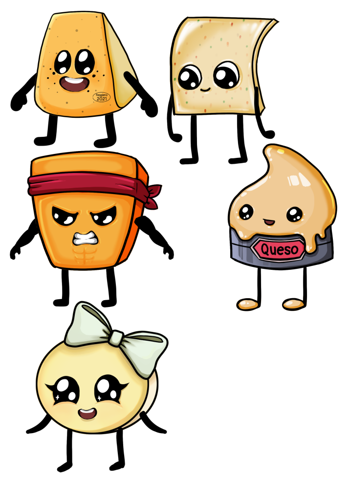

# 🧀 The Grate Escape

**The Grate Escape** is a vertical arcade platformer where you play as a piece of cheese fighting to escape the inside of a cheese grater.

Built in Unity with C# and featuring original artwork and a custom soundtrack, this project was completed just before I began my undergraduate degree in Computer Science — back when I was still working my high school retail job.

---

## 🎮 Gameplay

- Climb your way out of a cheese grater by ascending platforms
- Dodge spinning blades and dangerous obstacles
- Survive a procedurally generated infinite level with increasingly difficulty

---

## ✨ Features

- 🧠 Written in **C#** using the Unity engine (transitioning to the Godot Engine soon)
- 🎨 All **art assets** are original and hand-drawn
- 🎵 Includes a custom soundtrack and sound effects
- 📱 Designed for mobile play

---

## 📸 Screenshots

| Start Screen | Tutorial Screen | Characters | App Icon |
|--------------|-----------------|------------|----------|
|  |  |  |  |
